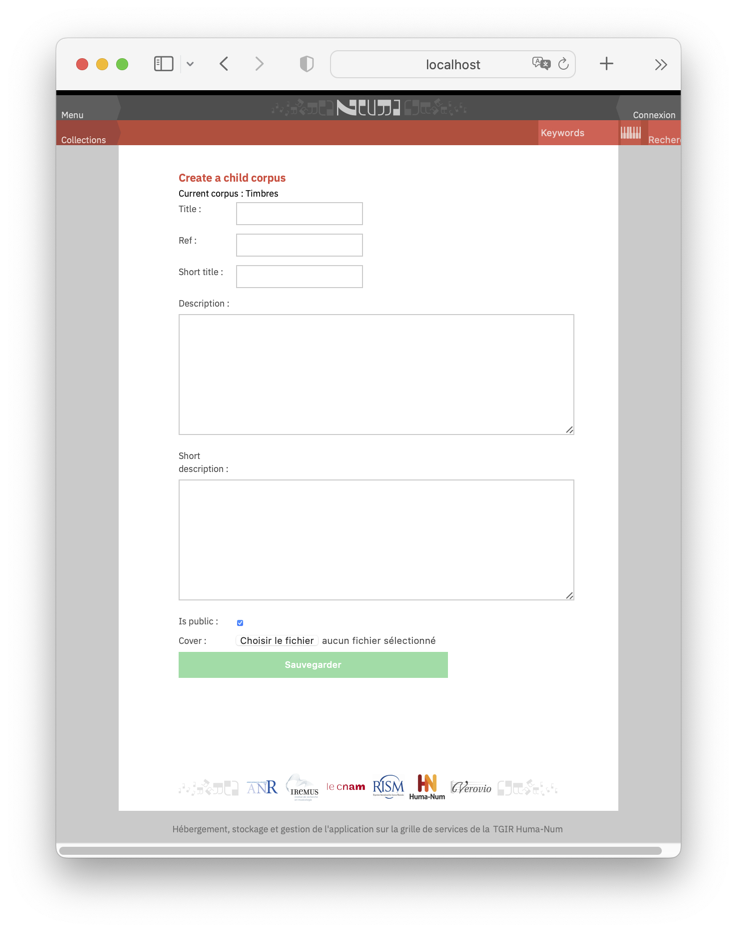

.. _chap-datamgt:

###############
Data management
###############

Data management tasks are reserved to the administrators or
to users with an ``editor`` role on the corpus. They can be performed
either via web forms, or by exporting/importing files. 

*********************
Form-based management
*********************

The "management" tab
====================

A user with editor rights on a corpus can access to the corpus management 
function via a "Management" tab. By clicking to this tab, 
one obtains the forms shown on   :numref:`manageCorpus`. 

.. _manageCorpus:
.. figure:: ./figures/manageCorpus.png       
        :width: 90%
        :align: center
   
        Managing a corpus and its sub-corpuses

The following actions are  proposed

  - Editing the corpus, to change or complete its description
  - Adding a sub-corpus
  - Adding a zip file containing a list of opuses to import in the corpus
  - Importing a zip file
  - Exporting the corpus content as a zip file
  
Editing corpuses
================

The *Edit corpus* form is shown on :numref:`editCorpus`. 
This form can be used for creating and 
editing (modifying) corpuses.

.. _editCorpus:
.. figure:: ./figures/editCorpus.png       
        :width: 90%
        :align: center
   
        Corpus form 
        
Fields:

 - title, for the main page of the corpus
 - short title, used for lists and links
 - description
 - short description (a few lines) 
 - ``isPublic``: a corpus can be either *Public* (not access restrictions) or *Private*. In the
   latter case it is shown only to users with access grants.
 - Parent corpus: each corpus has a unique parent. Choose the parent from the list
 - Reference code: this is the *global* reference code, for instance ``composers:bach:chorals``
   for the ``chorals`` corpus, child of ``bach``, itself child of ``composers``. **Be very careful**
   when entering the reference, because its is essential to ensure the consistency of 
   navigation and searches in Neuma.
 - The cover is an image that illustrates the corpus.

Adding a sub-corpus
===================

A sub-corpus is added with the form shown on :numref:`add_sub_corpus`. All
the fields are mandatory, and in particular an image that serves to illustrate the corpus.

.. _add_sub_corpus:

   
        Adding a sub-corpus

If the new corpus is not *public*, access rights must be 
specified by an administrator.
    

Adding an Opus
==============

An Opus can be added via a form. However, the preferred method is to
load a set of opuses via a Zip file.

Upload a ZIP file
=================

In the *Management* tab of a corpus, a form allows to upload a zip file. You must supply
a sort description of the Zip content, and the Zip file itself. 

Once uploaded, Zip files appear in a list, left of the *Management* tab. Note the ID of a
file which is required to trigger its insertion.
See the next section for instructions regarding the organization and format.

       
*******************
Importing/exporting
*******************

In general opuses are managed in batches. The main procedure consists in importing
(and exporting) Zip files (called "neumazip" from now on) 
containing opuses contents. Actually such zip files
can contain full subsets of the Neuma collection, including a hierarchy of corpuses.

.. note:: You can download an example of a neumazip at 
          https://neuma.huma-num.fr/static/sample.zip. It contains a few opus from
          Camille Saint-Saëns.

Organization of neumazips
=========================

The organization of neumazips containing corpus/sub-corpuses/opuses is similar to
that  on your computer, where *directories* play the role of corpuses, and
*files* the role of opuses. The local reference of the corpus is the directory name,
and the files in the directory contain the opuses' description. 

The metadata of the corpus is stored in a JSON file named ``corpus.json``. There 
must also be an image file named ``cover.jpg``.

Now, for each opus,
there are actually *at least* two files:

 - A MusicXML (and its compressed variant) or MEI file containing the default score
 - A JSON file containing the metadata.
 
.. note:: For XML files (scores), three extensions are accepted:  'xml' for MusicXML, 'mxl' 
   for compressed MusicXML, and 'mei' for MEI.

For a given opus with reference ``xyz``, those files are respectively named
``xyz.xml`` (the extension might be ``mxl`` or ``mei``) and ``xyz.json``.

.. admonition:: Example

   Assume a corpus with reference ``corp`` and two opuses, with 
   respective references ``opA`` and ``opB``. On your computer, it
   corresponds to a directory named ``corp`` with the following files:
   
     - a JSON file ``corpus.json`` containing corpus metadata 
     - A JPEG fil ``cover.jpg`` which contains the icon of the corpus
     - a file ``opA.json`` containing opA metadata 
     - a file ``opA.xml`` containing the MusicXML default score for opA
     - a file ``opB.json`` containing opA metadata 
     - a file ``opB.xml`` containing the MusicXML default score for opA
   
   By compressing the directory ``corp``, you obtain a ``corp.zip`` file
   ready to be inserted in an existing corpus of Neuma.
 
**Be careful with  references**: the directory name (without extension)
defines the corpus local reference, and the file names (without extension)
define the local reference of an opus inside its corpus. 

.. admonition:: Example

    If one imports the  corpus ``corp``  in a parent corpus with global reference
    ``all:parent``, the global reference of the new corpus is ``all:parent::corp``,
    and the two  opuses get the respective global references ``all:parent::corp:opA`` and ``all:parent::corp:opB``.

Opus references cannot be modified after import.  **Use a consistent naming scheme,
in lowercase, as short as possible**. Note that opuses are sorted
on their (local) reference whenever a corpus is displayed. This must be anticipated
if order is important. For instance,  
``opus_1``  appears before ``opus_2`` in alphanumeric order,
but the latter  appears *after* ``opus_12``. Use padding with '0' 
to obtain a correct sorting, such as ``opus_01``,
``opus_02``, ``opus_12`` (in case two  positions are enough).

Format of metadata JSON files
=============================

The metadata of a corpus is given in a JSON file named ``corpus.json``. It
minimal content is as follows (taking as an example the Saint-Saëns sample file):

.. code-block:: json

 	  {
		"ref": "sample",
		"title": "Œuvres de Saint-Saëns",
		"short_title": "Saint-Saëns",
		"description": "Sélection d'œuvres de Saint-Saëns",
		"short_description": "Sélection d'œuvres de Saint-Saëns",
		"is_public": true
	 }

This constitutes the few metadata that will be used to create the corpus. You
can provide a minimal information: once created, the corpus can be edited with
the web form.

If you unzip ``sample.zip``, you will also find the following list
of JSON files ``C006_0.json``, ``C009_0.json``, ``C035_0.json`` and ``C079_0.json``
(each file also comes with a MEI companion). 

The minimal content of an opus JSON file is the following:

.. code-block:: json

	{
		"local_ref": "C006_0",
		"title": "[Dans les coins bleus]"
	}

where ``local_ref`` is the local reference of the opus.

.. note:: Actually, the ``local_ref`` is optional. The import process
   will take the name of file (without extension) as the opus reference.

The definition of an extended format for opus metadata is in progress.

Uploading files
===============

The neumazip containing a corpus content must be uploaded in the *parent*
of the corpus to create.  In order to import the  corpus ``corp``  
in corpus ``all:parent``, upload your neumazip in ``all:parent``
using the form in the *Management* tab. The content
of the neumazip will then be imported as a sub-corpus of``all:parent`.

.. important:: If the sub-corpus already exists, its is *not* replaced. Opuses
   that do not already exist are simply added to the existing corpus.

****************
Managing sources
****************

