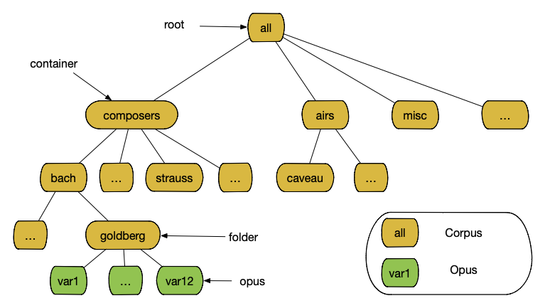
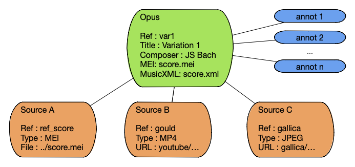
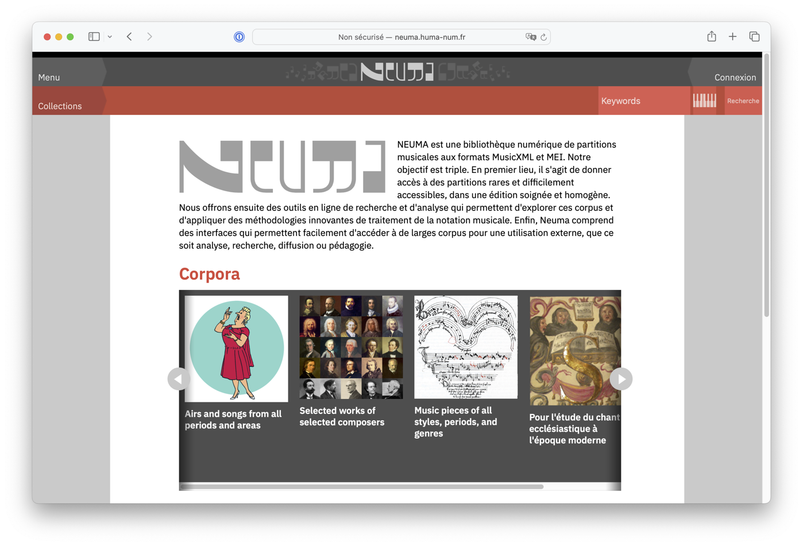
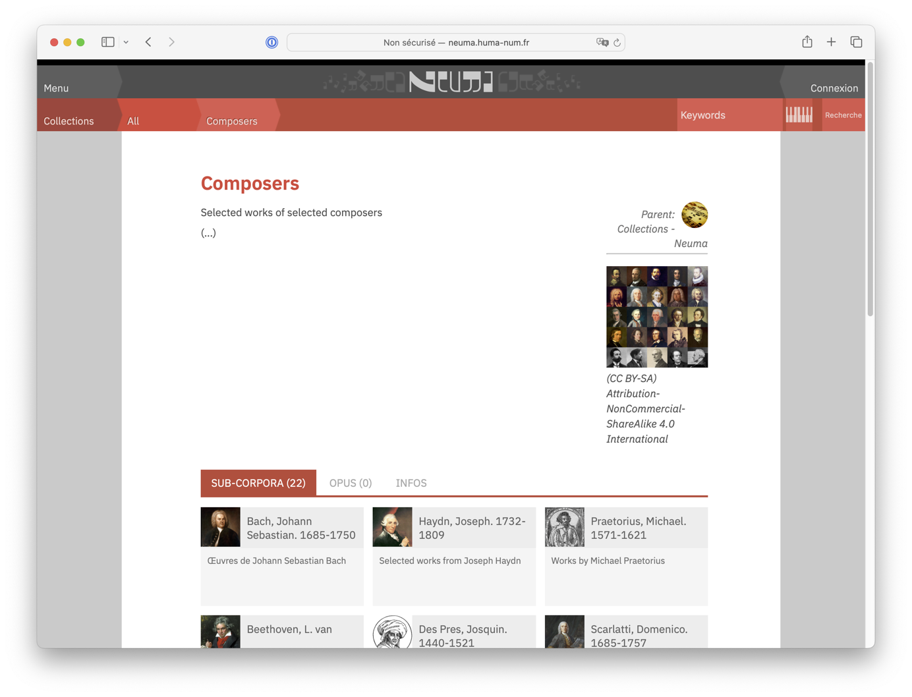
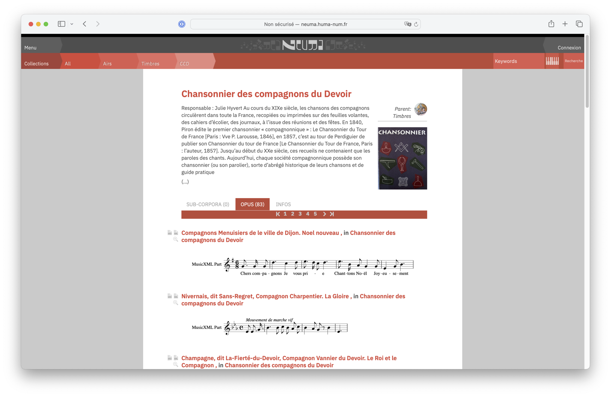
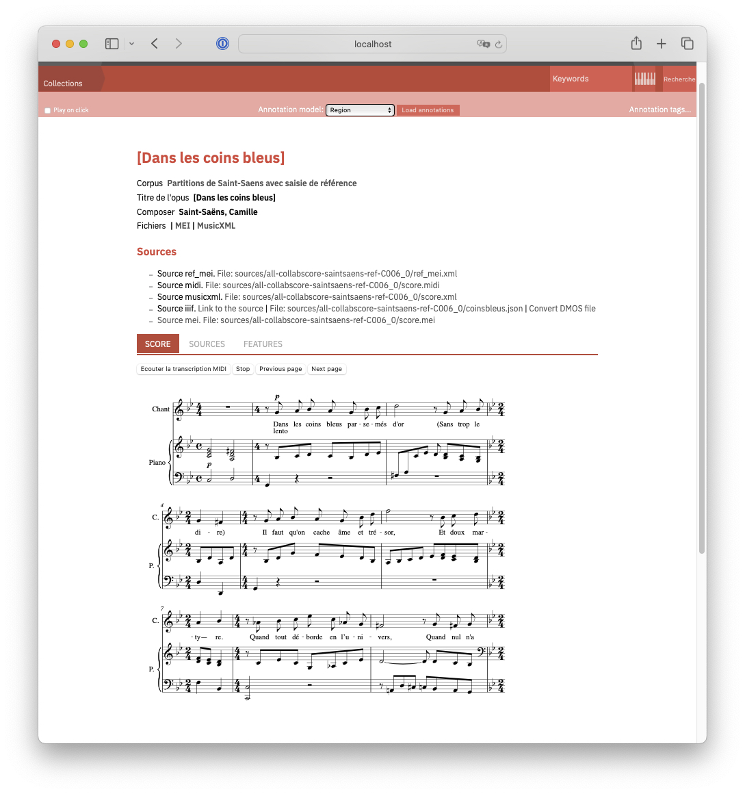

.. _chap-dataorg:

#################
Data organization
#################

***************
Main principles
***************

Corpus and opus
===============

The main objects managed in Neuma are *corpus(es)* and *opus(es)*. They 
implement a data organization comparable to the classical
concepts of *directoris* and *files* in a computer. A *corpus*
is a container. Its content consists of either 
opuses or (sub)corpuses. 
An *opus* is a musical work, such as, e.g., The Goldberg variations
or The New World Symphony. Thus, data in Neuma is essentially
a hierarchy,  rooted at as pseudo-corpus named *all*, where internal nodes
are corpuses, and leaves are opuses. :numref:`dataorg` illustrates the structure.

.. _dataorg:

   
        Data organization in Neuma

Both corpuses and opuses are described by textual meta-data, along
with several other data items, e.g. typically files.

.. note:: In the following, for the sake of clarity, we will use 
   the following terminology:
   
     - a *container* is a corpus that contains sub-corpuses
     - an *folder* is a corpus that contains opuses

A third, important type of object is called *Source*. A source is
any digital document that represents an information about an opus. 
A source is typically a file that encodes the music in a format such as
MusicXML or MEI. A source can also be an audio file, an image, atextbook, an
external document that refers to the opus, etc (:numref:`opus_org`). 

Finally, an opus can be annotated. Annotations express a statement
(the *body*) about an opus or one of its sources (the *target*).

.. _opus_org:

   
        Structure of an Opus

In Neuma, Corpus and Opus objects
receive a unique and immutable reference when they are
created. Since this reference is essential for further data 
management tasks, this is the first aspect to address.

Managing references
===================

Each object, whether *corpus* or *opus*, is identified by a unique Neuma *reference*. 

 - The *local refrence* uniquely identifies an object in the context of
   its corpus. For instance, in the context of the ``goldberg`` corpus,
   ``var1`` and ``var12`` are local references uniquely identify opuses.
 - the *global* reference uniquely identifies an object in Neuma. It 
   takes the form of a path from the top-level corpus to the object, 
   represented as follows:

   .. code-block:: text
   
         all:ref2:...:refN
         
   where each *refi* is a *local* reference. 
   
The top-level corpus
reference is *all*, hence all pathes begin with ``all:``.
The first *n-1* references are local *corpus* references (since
internal nodes of the hierarchy consist of corpuses). 
The last reference is either a corpus local
reference of an opus local reference, depending of the 
object referred to.

Let's take some examples:

  - the corpus *Composers*, with local reference ``composers``, located
    below the top-level corpus, has ``all:composers`` as its global reference;
  - the corpus *Monteverdi*, with local reference ``monteverdi``, located
    below the *Composers* corpus, has ``all:composers:monteverdi`` as its global reference;
  - the opus *Madrigal XII*,  with local reference ``madrigal12``, located
    below the *Monteverdi* corpus, has ``all:composers:monteverdi:madrigal12`` as 
    its global reference.

Global reference are therefore quite similar to  absolute paths in a file system. 
*In Neuma, references are the primary mean to refer to an object (corpus or opus)
and they are immutable (no way to change them after creation*. Hence they
ust be chosen with great care.
Although the choice of reference string is free, there are some good practices highly
recommended:

  - use short, and if possibly meaningful, identifiers,
  - allways use lowercase strings,
  - never us special characters, and preferably avoid accents.
  - ensure that a local reference is unique inside its container
  - seek for consistency: the set of local references in a given container
    should follow the same pattern.

Let's now explain these concepts in details.

*****************
The Corpus object
*****************

The hierarchy of corpuses
=========================

Initially, Neuma proposes the root corpus, and a few pre-defined corpuses 
(children of the root) for generic 
categories of musical works. They are shown on the welcome page of Neuma
(:numref:`initialCorpus`).

.. _initialCorpus:

   
        The root (initial) corpus

By clicking on a corpus's icon, one obtain a page that 
details the corpus content. 
New corpus can be inserted in the hierarchy by authorized users. 
The complete list of corpuses, along with some stats of their opuses,
is shown at http://neuma.huma-num.fr/home/collections

Containers
==========

Let's examine first the case
of a *container*, e.g., a corpus that contains
sub-corpus. Examine :numref:`exploringCorpus` below,
showing the page dedicated to corpus ``all:composers``.

.. _exploringCorpus:

   
        A corpus with sub-corpuses

Each corpus consists first of some general informations:

  - a title, in short and detailed form. The short form is 
    used for navigation purposes: see the breadcrumb at the top of the page
  - a description, also in short and detailed forms.
  - a licence, that applies to all the corpuses contents
  - a cover image, used as an icon in lists
  - and finally, the list of sub-corpuses or opuses.

Note also that each corpus has a unique parent. By clicking
on the parent's icon, one can move up one level in the hierarchy.

Folders
=======

It turns out that ``all:composers`` consists only of sub-corpuses,
one for each composer. For a *folder, a corpus consisting of opuses, the page 
presents a list with a music score incipit (:numref:`exploringCorpus`, showing
the first opuses of corpus ``all:airs:cdc``).

.. _exploringCorpus2:

   
        A corpus with opuses

Each opus in the list is shown with a title, the composer (if known)
and the corpus it belongs to. By clicking of the title, one can access
to the page that details the opus.

***************
The Opus object
***************

An Opus gathers a set of information related to a musical work,
including  *digital score* in XML format (MusicXML or MEI). 
:numref:`opus_page` shows how this information is displayed in the
web page dedicated to an opus. 

.. _opus_page:

   
        A page showing an Opus

Metadata
========

Each opus is described by a short list of pre-defined attributes:

  - a title, in short and detailed form. The short form is 
    used for navigation purposes: see the breadcrumb at the top of the page
  - a description, also in short and detailed forms.
  - a composer (optional)

Additionally, a list of free metadata can be added, as a list of key-value pairs.

Score
=====

The default display of an Opus in Neuma is taken from a MEI or MusicXML file. They
must be provided at the Opus creation.

Sources
=======

A list of *sources* can be associated to an Opus. Whereas an opus gathers
information about a musical work, a *source* provide an actual
digital representation of this work.  A source is essentially a digital document
which can be

  - a file associated to the source, locally stored in Neuma, or
  - an external document referred to by it URL.
 
Both the MEI and MusicXML files used for displaying an Opus in Neuma are alos stored
as sources. In addition, here is a non limitative list of source examples:

  - an image of a legacy score, stored in a digital library (e.g., Gallica), and referred to by it URL;
  - an audio file, stored locally
  - a video, stored in an external media server (e.g., YouTube) 
  - any encoding of a score, in any format
  - a textbook
  
Each source is described by a short list of pre-defined attributes:

 - a code that serves as a unique identifier to refer to a source in the context of its opus
 - a description
 - a type (image, audio, XML, etc.)
 - a URL, or
 - a file content
 
Features
========

To be developped.

Annotations
===========

To be developped.

